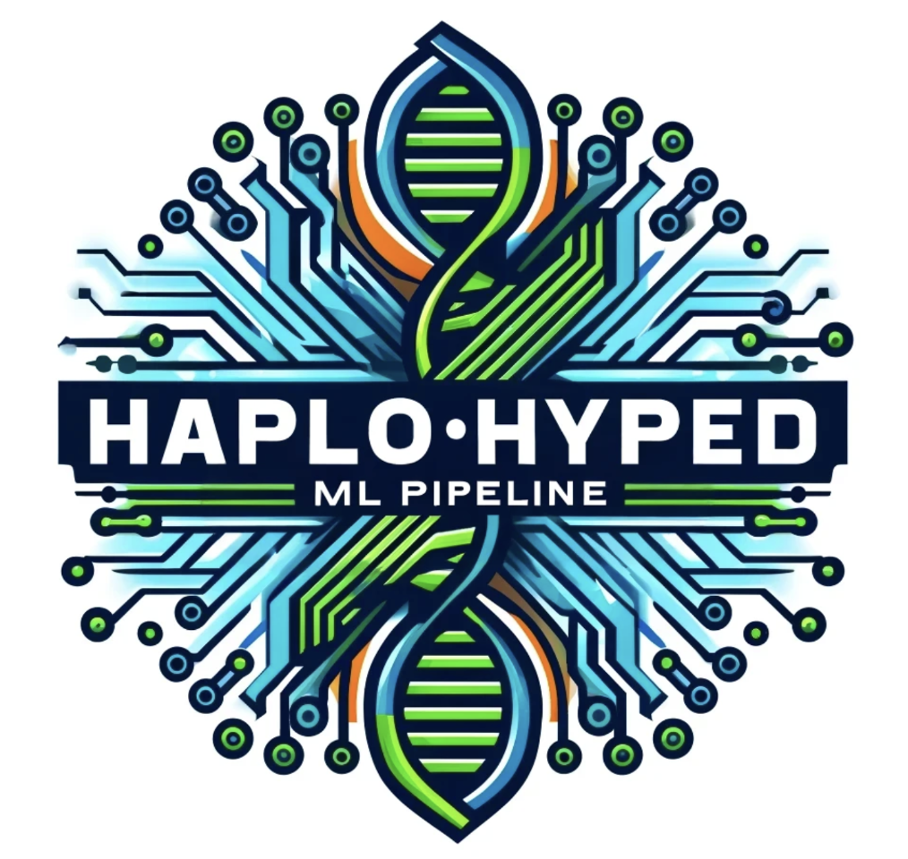

# HaploHyped VarAwareML Pipeline



The HaploHyped VarAwareML Pipeline is an integrated, end-to-end solution for processing genomic data, converting VCF files to HDF5 format, and performing GPU-accelerated on-the-fly haplotype encoding for machine learning.

**Note:** This code was rewritten and optimized by software developer Aaron Ho.

## Features

- End-to-end workflow from raw VCF processing to ML model training
- Parallel processing and optimization techniques
- Efficient data storage with HDF5
- GPU-accelerated on-the-fly haplotype encoding
- Seamless integration with PyTorch for ML
- C++ integration for high-performance VCF file manipulation using `vcfpp`
- Python bindings for C++ code using `pybind11`

## Installation

### Prerequisites

- Conda
- CUDA for GPU acceleration

### Steps

1. Clone the repository:

    ```bash
    git clone https://github.com/Jaureguy760/HaploHyped-VarAwareML.git
    cd HaploHyped-VarAwareML
    ```

2. Create a Conda environment:

    ```bash
    conda env create -f environment.yml
    conda activate haplohyped-env
    ```

3. Install the package:

    ```bash
    pip install -e .
    ```

## Usage

### Data Processing Script

The main script for converting VCF data to HDF5 format and processing the data is `vcf_to_h5.py`. This script can handle storing individuals and chunk-wise processing.

### Usage


1. **Process VCF to HDF5 (Chunk-wise):**

    This step processes the VCF file and stores the genotype data into HDF5 files with compression.

    ```bash
    vcf_to_h5 --cohort_name <cohort_name> --vcf <vcf_directory> --outdir <output_directory> --sample_list <sample_list_file> --cores <number_of_cores> --cxx_threads <number_of_threads>
    ```

### Example Commands

**Process VCF to HDF5:**

```bash
vcf_to_h5 --cohort_name my_study --vcf /path/to/vcf_files --outdir /path/to/output --sample_list sample_list.txt --cores 10 --cxx_threads 4
```


2. **Process VCF to HDF5 (Chunk-wise):**

    This step processes the VCF file and stores the genotype data into HDF5 files with compression.

    ```bash
    vcf_to_h5 --cohort_name <cohort_name> --vcf <vcf_directory> --outdir <output_directory> --sample_list <sample_list_file> --cores <number_of_cores> --cxx_threads <number_of_threads>
    ```
    
## C++ Integration

This project includes a C++ module for high-performance VCF file manipulation using the `vcfpp` library. The `vcfpp` library provides an easy and safe API for working with VCF/BCF files and is compatible with C++11 and later.

For more information about `vcfpp`, visit the [vcfpp GitHub repository](https://github.com/Zilong-Li/vcfpp).

### Features of `vcfpp`

- Single file for easy inclusion and compilation
- Easy and safe API
- RAII (Resource Acquisition Is Initialization) for automatic memory management
- Full functionalities of `htslib`, including support for compressed VCF/BCF and URL links
- Compatible with C++11 and later

### Using `pybind11` for Python Bindings

We use `pybind11` to create Python bindings for the C++ code, enabling seamless integration of high-performance C++ functionalities into our Python workflow.

For more information about `vcfpp`, visit the [vcfpp GitHub repository](https://github.com/Zilong-Li/vcfpp).

## Contributing

Please read `CONTRIBUTING.md` for details on our code of conduct, and the process for submitting pull requests to us.

## License

This project is licensed under the MIT License - see the `LICENSE` file for details.
